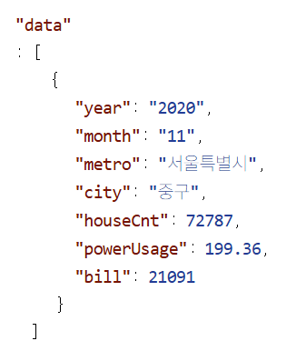
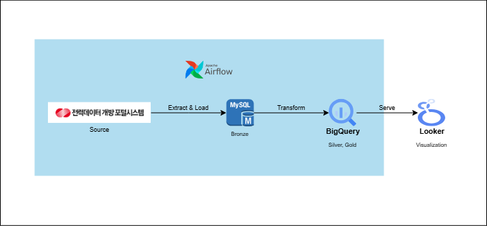

# HOUSEHOLD_POWER 프로젝트

public_data 프로젝트의 일부로 지역별 가구 평균 전력 사용량 데이터를 수집하고 분석합니다. 지역별, 기간별 데이터를 제공하는 공공데이터 중 **전력 사용량의 경우 날씨, 주거 인구수 등과 결합하여 분석하기 좋은 소재라고 생각되어** 가장 먼저 진행하게 되었습니다.

## 기술 스택
수집 및 가공 : **Python, Pandas, Jupyter Lab**
데이터베이스 : **MySQL, BigQuery**
파이프라인 : **Airflow**
시각화 : **Looker Studio**
프로젝트 관리 : **Github**

## 데이터 소스
사용 데이터는 [**전력데이터 개방 포털시스템**](https://bigdata.kepco.co.kr/cmsmain.do?scode=S01&pcode=main&pstate=L&redirect=Y)에서 제공하고 있는 [**가구평균 전력사용량 API**](https://bigdata.kepco.co.kr/cmsmain.do?scode=S01&pcode=000493&pstate=house&redirect=Y)를 수집하여 사용하였습니다.

#### 제공 데이터
API에서는 다음과 같은 데이터를 제공하고 있습니다.



| 필드 | 설명 |
|------|------|
| year, month | 연도, 월 |
| metro (sd_name) | 광역시도 |
| city (sgg_name) | 시군구 |
| houseCnt | 해당 지역 가구 수 |
| powerUsage | 가구 평균 전력 사용량 (kWh) |
| bill | 가구 평균 전기 요금 (원) |

데이터는 2015년 5월부터 2025년 12월까지의 데이터를 수집하였고, 주에 한번씩 API를 확인하여 새로운 데이터가 나왔을 경우 자동으로 수집되도록 Airflow 파이프라인을 구축하였습니다.

## 파이프라인 아키텍처


```
API (KEPCO) → MySQL (Bronze) → BigQuery (Silver) → BigQuery (Gold) → Looker Studio
```

## 파이프라인 상세

### 1. insert.ipynb (Bronze)
최초로 API를 이용해 데이터를 수집하는 과정입니다. **수집한 그대로의 순수한 RAW데이터를 MySQL에 저장**합니다.

- 17개 광역시도 × 연도(2013~2025) × 월(1~12)을 순회하며 데이터 수집
- 기존 수집 여부를 확인하여 중복 수집 방지 (`is_already_collected`)
- API 요청 간 5초 간격으로 Rate Limit 준수
- 배치 단위로 MySQL에 저장 (`save_batch`)

### 2. transform.ipynb (Silver)
MySQL의 RAW데이터를 읽어 Pandas를 이용해 데이터를 클렌징합니다.

- **결측치 처리**: 음수 값을 NaN으로 변환 후, 지역별 그룹 내 보간법(interpolation)으로 수정
- **지역명 통합**: 행정구역 변경으로 분리된 지역을 가구 수 가중평균으로 통합
  (예: 부천시 원미구/소사구/오정구 → 부천시)
  - 가중평균 = Σ(평균사용량 × 가구수) / Σ(가구수)
- **데이터 타입 검증 및 변환** 후 BigQuery에 저장

### 3. make_fact.ipynb (Gold)
Silver Data를 가지고 분석에 활용할 Fact 테이블을 생성합니다.

- **시간 차원 추가**
  - 분기(quarter): `(month - 1) // 3 + 1`
  - 계절(season): 봄(3~5월), 여름(6~8월), 가을(9~11월), 겨울(12~2월)
  - 요금제 계절(season_tariff): 하계(7~8월) / 기타
- **파생 지표 계산**
  - `total_usage_kwh`: 가구수 × 평균사용량 (지역 총 소비량)
  - `total_bill_won`: 가구수 × 평균요금 (지역 총 요금)
  - `unit_price`: 평균요금 / 평균사용량 (kWh당 단가)
  - `usage_yoy_pct`: 전년 동월 대비 변화율
  - `usage_mom_pct`: 전월 대비 변화율

## Fact 데이터 모델링
```mysql
CREATE TABLE household_power.fact(
    -- 차원 (Dimension) --
    year              INT64,
    month             INT64,
    quarter           INT64,            -- 분기
    season            STRING,           -- 계절
    season_tariff     STRING,           -- 요금제 계절 구분

    sd_code           INT64,
    sd_name           STRING,
    sgg_name          STRING,

    house_cnt         INT64,
    avg_usage_kwh     FLOAT64,           -- power_usage 리네이밍
    avg_bill_won      FLOAT64,           -- bill 리네이밍

    total_usage_kwh   FLOAT64,           -- house_cnt * avg_usage_kwh
    total_bill_won    FLOAT64,           -- house_cnt * avg_bill_won
    unit_price        FLOAT64,           -- avg_bill_won / avg_usage_kwh

    usage_yoy_pct     FLOAT64,           -- 전년 동월 대비 변화율
    usage_mom_pct     FLOAT64            -- 전월 대비 변화율
)
PARTITION BY RANGE_BUCKET(year, GENERATE_ARRAY(2016, 2030, 1))
CLUSTER BY sd_name, sgg_name;
```

## 작업 과정
- API의 데이터 수집 기간은 어떻게 확인하였을까?
- Transform 과정은 어떻게 되나요?
- 계절을 나누는 기준은?
